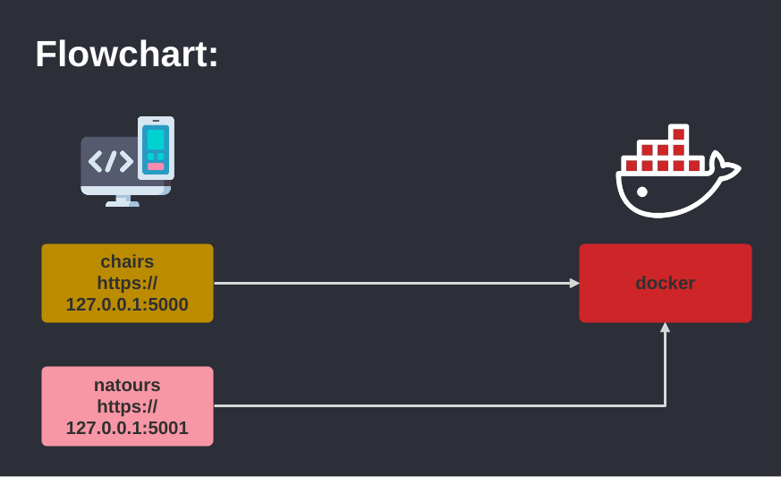

Frontend     
========

### Run:
```
docker-compose up --build && \
docker-compose down && \
docker rmi $(docker images --format="{{.ID}}" frontend_*) --force && \
docker volume prune
```
**Note:**

Example web pages, simple run command and check in the browser
+ [chairs](https://github.com/Martin1403/Frontend/tree/master/webpages/chairs) Simple webpage
+ 
