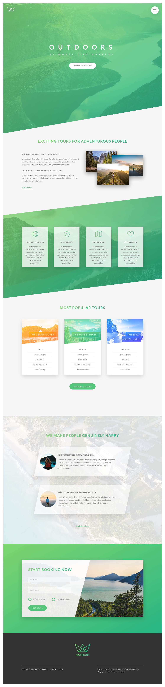

### Venv: 
###### python3.9
```
python -m venv .venv && \
source .venv/bin/activate && \
pip install -U pip && \
pip install -r requirements.txt
```
### Run:
###### /
```
source .venv/bin/activate && \
export QUART_APP=app:app && \
export QUART_ENV=development && \
quart run -h "127.0.0.1" -p 5002
```
### Docker:
###### /frontend
```
docker build -t app . && \
docker run -it --rm -p 5002:5002 app && \
docker rmi app --force
```

###### [Links]():
- ###### [resources](https://codingheroes.io/resources/) CSS HTML DESIGN ... resources 
- ###### [open-colors](https://yeun.github.io/open-color) Colors with shades
- ###### [coolors](https://coolors.co/) Color shader (contrast checker)
- ###### [unsplash](https://unsplash.com/) Free images
- ###### [icon-pack](https://heroicons.com/) Free SVG icons 