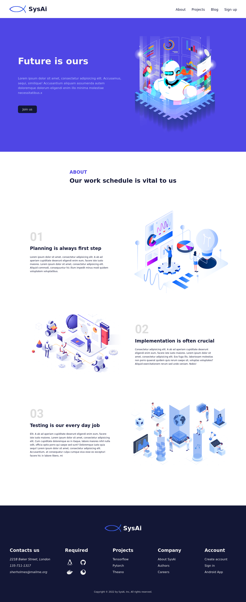

# SysAi


Grid, flexbox layouts.
### Venv: 
###### python3.9
```
python -m venv .venv && \
source .venv/bin/activate && \
pip install -U pip && \
pip install -r requirements.txt
```
### Run:
###### /
```
source .venv/bin/activate && \
export QUART_APP=app:app && \
export QUART_ENV=development && \
quart run -h "127.0.0.1" -p 5005
```
### Docker:
###### /frontend
```
docker build -t app . && \
docker run -it --rm -p 5005:5005 app && \
docker rmi app --force
```

### Development:
```bash
npm start
```

###### [Links:]()
+ ###### [Icons](https://ionic.io/ionicons) for footer