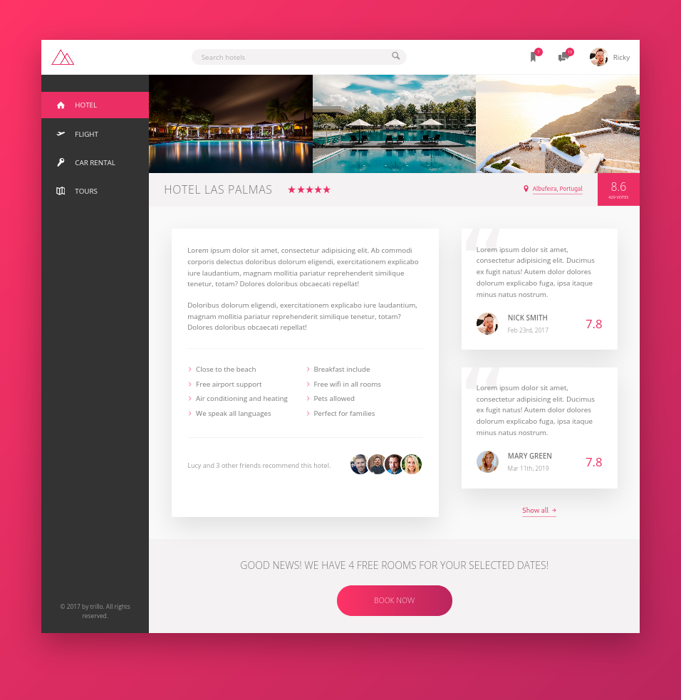

# Trillo
Trillo is a webpage app about booking hotel, ...




Flexbox layouts.
### Venv: 
###### python3.9
```
python -m venv .venv && \
source .venv/bin/activate && \
pip install -U pip && \
pip install -r requirements.txt
```
### Run:
```
source .venv/bin/activate && \
export QUART_APP=app:app && \
export QUART_ENV=development && \
quart run -h "127.0.0.1" -p 5003
```
### Docker:
```
docker build -t app . && \
docker run -it --rm -p 5003:5003 app && \
docker rmi app --force
```


### Sass:
- ###### Install cmds:
```bash
npm init # Initialize, create package.json
npm install node-sass --save-dev
npm install jquery --save # --save as dev to package.json
npm uninstall jquery --save
npm install postcss-cli -g
npm install -g # -g stands for globally
```
+ ###### Run:
```bash
npm run start 

# With these two, chrome auto update CSS (Tested-OK)
npm run watch:sass
live-server
```

###### [live-server](http://127.0.0.1:8080/)

**Note:**
+ Install packages.
+ Run "npm run start".
+ Visit [link](http://127.0.0.1:8080/)/
+ In order to work with auto-reload, the page must be open only in Chrome.

###### [Links:]()
+ ###### [Icons](https://icomoon.io/) 
